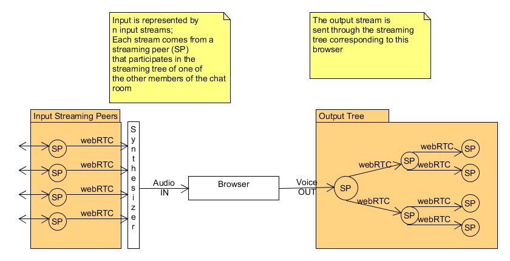

# Real Time P2P Voice Chat over the browser

It has never been easier to communicate with one another than it is these days. Internet
communications have created a whole new way of interacting with people from afar. However, most of
the popular communication apps have centralized servers that direct the traffic (Facebook, Google
Hangouts, etc).
This project proposes a decentralized solution for real life communications over the internet, using
only one's browser. The advantage of this is that people can have a more secured and trustworthy
communication channel over the internet by opening a direct (and possibly secured) stream between
their computers.

# Use Cases

1. P2p communication between two browsers:
Users should be able to directly contact each other and open a communication stream
between one another
2. P2P communication between multiple browsers
Users should be able to create chat rooms, having direct communication streams between
them. There is no “master-user” or chat administrator here. This is just a simple chat room
where friends can talk to each other.
3. Ability to custom block certain peers in chat rooms
Each participant of the chat room can potentially block messages from a different room
member. These messages will only be blocked for the blocker, all other members of the chat
room can still see them.
4. Traffic rebalancing based on blocked peers (extra)
This is a potential for further optimizations, where if a certain peer is blocked by multiple peers
then traffic could be redistributed in the network s.t. resource waste is minimal.

# Architecture
The architecture of this system is based on multiple streaming trees with WebRTC connections
between peers.
The proposed peer interaction is presented bellow:

Each chat participant has its own streaming tree to which it publishes its data (Voice OUT). Besides
this, it will have 1 node in each of the other participants output trees (SPs). The input to the browser is
a combination of all the input streams from the other participants. Involving a Synthesizer component
at this point allows for custom voice control for all the other participants in the chat.

# Resources

* Analysis of the Skype p2p protocol: https://arxiv.org/abs/cs/0412017
* RTC over the browser: pdf
* WebRTC API: https://developer.mozilla.org/en-US/docs/Web/API/WebRTC_API
* ICE: https://en.wikipedia.org/wiki/Interactive_Connectivity_Establishment
* P2P Meadia streaming with html5 & WebRTC:
https://pdfs.semanticscholar.org/3ec3/25bdfeed455976be4e7c14507b15e5340e49.pdf
* Distributed and adaptive HTTP data streaming
* Distributed Streaming patent
* Guardian tree: A single Tree-Based P2P live streaming system (…) ; Emil Stephansen, Kasper
* Latency Aware multi-tree based P2P live video streaming; Jens Frederik Krogh Holdam,
